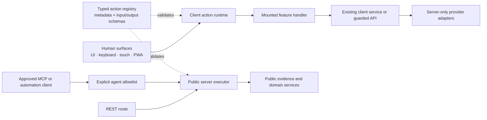

# Unified action architecture

The action layer lets a human or approved machine surface request the same bounded behavior without making a React component, keyboard shortcut, PWA control, or future agent the owner of that behavior. Adoption is incremental: working labs keep their existing services until an action boundary makes them simpler or safer.

## Current shape

ONE Voice Lab is a Next.js App Router application with React client experiences and server-only route handlers. Its existing architecture already has useful boundaries:

- provider identity and readiness live in the shared typed provider registry;
- provider-specific execution remains in capability adapters and guarded server routes;
- evaluation requests, evidence, and human ratings use versioned Zod schemas;
- authentication and optional persistence use existing Supabase boundaries;
- keyboard commands use the central shortcut registry and visible mounted controls;
- the PWA shell reuses the browser application and service worker without caching API, authenticated, audio, or video traffic.

The action layer extends those boundaries; it does not replace them.



There is deliberately no universal `/api/actions/:name` endpoint. Registration describes an action; it does not expose it. Existing route guards, authentication, rate limits, spend gates, and provider-specific validation remain authoritative.

## Core modules

| Module | Responsibility |
| --- | --- |
| `src/lib/actions/contracts.ts` | Shared action sources, trust levels, usage classes, error categories, and discriminated result types. |
| `src/lib/actions/registry.ts` | Immutable action definitions with human metadata plus executable Zod input and output schemas. |
| `src/lib/actions/results.ts` | Invocation IDs, wall-clock/monotonic result metadata, validation failures, cancellation, and safe error normalization. |
| `src/lib/actions/client-runtime.ts` | Registers handlers owned by mounted browser features and dispatches validated, source-aware actions. |
| `src/components/actions/VoiceLabActionProvider.tsx` | Provides one stable browser runtime to the React tree and unregisters handlers on unmount. |
| `src/lib/actions/server/executor.ts` | Executes the small allowlist of public, nonbillable, server-safe actions. |
| `src/lib/actions/public-client.ts` | A bounded client transport for the existing synthetic-evaluation endpoint. |

## Registry semantics

Every definition records:

- a stable namespaced action name and human-readable description;
- required input fields and output shape for discovery;
- executable input and output schemas for enforcement;
- authentication and trust requirements;
- approved invocation surfaces;
- whether the action is explicitly agent-exposable;
- usage/cost class and whether confirmation is required;
- its current implementation state.

Implementation states prevent the registry from overstating migration:

- `action-backed`: execution is available through the shared action layer;
- `dedicated-service`: the working feature keeps its existing specialized service or route while the registry documents a future-safe contract;
- `client-bridge`: a mounted browser feature must register the handler; no handler means a structured `action_unavailable` result.

The registry is metadata plus validation, not authority. A caller must still pass every runtime security boundary.

## Structured results

Every dispatcher resolves to a discriminated result rather than leaking arbitrary exceptions:

```ts
type ActionResult<Name, Output> =
  | { ok: true; action: Name; invocationId: string; data: Output; meta: ActionResultMeta }
  | { ok: false; action: Name; invocationId: string; error: ActionError; meta: ActionResultMeta };
```

Metadata records the source, start/completion timestamps, monotonic duration, and usage class. Expected failures use stable codes and categories. Unexpected exceptions become a generic internal failure; provider payloads, credentials, authorization headers, and stack traces are not serialized.

## Browser execution

The root layout owns one `VoiceLabActionProvider`. A mounted feature registers only the actions it can currently fulfill and receives validated input, invocation context, cancellation signal, and source. Registration returns an unregister function, which the React hook invokes on unmount.

The runtime enforces this order:

1. validate input;
2. confirm the requested source is approved;
3. enforce explicit user-gesture requirements;
4. honor pre-execution cancellation;
5. select the most recently mounted available handler;
6. validate output;
7. return a safe structured result.

Microphone start, audio playback, and local download actions retain user-gesture boundaries. Merely declaring keyboard, touch, or PWA as an approved surface does not bypass browser permissions.

## Server and agent boundary

Only `AGENT_ACTION_ALLOWLIST` can reach the public server executor from MCP or automation. The current list is limited to public provider/evaluation evidence, methodology, comparison without ranking, and deterministic synthetic evaluation. These actions do not accept arbitrary scripts or audio, write storage, or invoke paid providers.

Provider-usage actions must remain explicitly human-confirmed, unavailable to MCP/automation, and marked `agentExposable: false`. Hosted live execution always requires the durable usage gate. Authentication is conditional and therefore recorded as optional: hosted policy requires a member by default, while anonymous execution exists only when an operator explicitly enables the separate durable guest boundary. Local live execution is a separate loopback-only development boundary marked `trusted-local`; it does not make a false hosted-authentication or durable-gate claim. Administrative, key-management, payment, voice-cloning, deletion, and unrestricted proxy actions are intentionally absent.

Future agent transports should generate their advertised tools from the allowlist, not from the whole registry, and should invoke the server executor rather than importing browser handlers.

## Stage 3 benchmark actions

Stage 3 extends the same registry with typed dedicated-service contracts for
planning a bounded benchmark, running the exact repository-owned fixture,
materializing an existing Evaluate bundle,
retrieving one owner-authorized canonical result, assessing comparability,
building one private metric leaderboard, retrieving the deterministic fixture
snapshot, listing a bounded page of public-verified snapshots, inspecting a
methodology, and verifying a canonical result hash. The Evaluate benchmark
workspace registers and dispatches `benchmark.plan`, `benchmark.runFixture`,
and `benchmark.fixtureLeaderboard` through the shared browser runtime. The
client-safe fixture service accepts only the exact canonical TTS scenario,
methodology, model, voice, configuration, repetition, and two-to-four-lane
bounds. It constructs the complete versioned evidence bundle and materializes
the canonical private result outside the presentation component. The action
returns both artifacts so alternate trusted clients retain reproducible,
machine-readable evidence. Result retrieval and public snapshot listing use a
server-only repository service whose strict, bounded schemas exactly match the
versioned database projections. Owner reads require an authenticated principal
and propagate only the server guard; public listing uses a bounded keyset
cursor. Broad REST and MCP exposure remains deferred.

These operations are deliberately not added to `AGENT_ACTION_ALLOWLIST`, MCP,
automation, or a generic REST executor. Planning makes no provider call, the
private aggregation actions consume only supplied validated evidence, and
`benchmark.runFixture` is deterministic, nonbillable, and performs no network,
provider, or storage request. It is a fixture evidence action, not a second live
executor. Existing
`evaluation.runFixture`, `evaluation.runProtectedLive`,
`evaluation.runLocalLive`, and `evaluation.cancel` remain the only provider
execution and cancellation contracts; Stage 3 creates no second live executor. Publication,
signing-key management, and administrative enablement are absent from the
client registry.

## the Scenario Studio Scenario Studio action

the Scenario Studio registers `scenario.runFixture` as a dedicated-service action for one
curated, repository-owned scenario. The mounted Scenario Studio handler sends a
strict, version-pinned request to `/api/scenarios/run`; the server—not the
browser—selects the installed scenario, fixture, and underlying
`publicEvaluation.runSynthetic` action. The browser cannot choose a provider,
model, arbitrary action, owner, trust tier, or live execution mode.

The route is POST-only, same-origin, content-type and byte bounded, strict-schema
validated, admitted through the existing `session_creation` quota, and returns
private no-store responses. Identity is server-derived and reduced to the
non-authorizing receipt scopes `guest-ephemeral` or `human-ephemeral`.
`scenario.runFixture` is not agent-exposable, is not in
`AGENT_ACTION_ALLOWLIST`, and creates no generic action endpoint.

The action produces one sanitized, versioned receipt and one pure deterministic
explanation. The receipt independently pins scenario, fixture, action-contract,
evidence, receipt, explanation-schema, and explanation-ruleset versions. Its
lifecycle status, evaluation outcome, evidence completeness, epistemic state,
and synthetic provenance remain separate so fixture evidence cannot become a
provider-performance or benchmark claim. **Explain This Run** only projects the
validated terminal receipt; it does not invoke the action runtime, an LLM, a
provider, or storage.

Scenario artifacts are React/request-memory only: there is no receipt GET,
history, database row, local/session storage, background replay, export, share,
MCP operation, or analytics event. A configured deployment may still use the
existing Supabase boundary to verify identity and update bounded pseudonymous
quota counters. That operational bookkeeping does not contain the scenario
request, receipt, evidence, or explanation. The scenario itself makes zero
voice-provider calls, consumes zero provider credits, and has no live branch.

Durable scenario history, provider-backed runs, arbitrary workflow authoring,
agent execution, and public receipt retrieval require separately authorized
contracts and security reviews.

## Provider isolation

Actions use stable provider IDs and capability schemas. They do not contain credentials or import provider SDKs into browser code. Live synthesis remains behind the existing server-side evaluation orchestrator, provider readiness checks, allowlisted models/voices, timeouts, cancellation, spend gate, and kill switch.

Do not move provider request construction into the registry or client runtime. An action coordinates a domain service; the capability adapter remains the provider-specific implementation.

## Adding or migrating an action

Use the smallest safe change:

1. Confirm that two or more surfaces genuinely need the same domain behavior.
2. Reuse an existing domain service or provider adapter; do not copy its logic into the action layer.
3. Add a namespaced definition with strict input/output schemas and honest implementation metadata.
4. Classify authentication, trust, source, cost, confirmation, and agent exposure independently.
5. Register a mounted client handler or add a narrow server dispatcher case.
6. Add tests for validation, unavailable/cancelled behavior, output validation, and secret-safe errors.
7. Add an action to the agent allowlist only after a separate security review proves it is public, bounded, nonbillable, and non-destructive.

## Intentionally unchanged

- Existing REST paths remain stable; the action registry does not create automatic endpoints.
- Working Deepgram, ElevenLabs, Fish Audio, and Cartesia adapters remain provider-specific and server-only.
- Existing evaluation orchestration, authentication, Supabase persistence, feedback, keyboard routing, and PWA lifecycle are not broadly rewritten.
- Provider-backed Live Mic start remains component-owned and is not registered as local recording; it needs a separate paid-action contract before migration.
- Browser-local actions require a mounted owner; they are not remotely callable.
- Live provider evaluation is not agent-exposable and anonymous live usage remains fail-closed.

## Verification

Focused unit coverage in `tests/unit/action-architecture.spec.ts` locks down registry uniqueness and schema metadata, the distinct protected-hosted and trusted-local paid-action boundaries, the explicit agent allowlist, absence of dangerous registered operations, network-free public execution, structured not-found/validation/cancellation outcomes, handler lifecycle, input/output validation, user gestures, and unexpected-error redaction. `tests/e2e/action-architecture.spec.ts` proves the migrated browser path reaches the existing deterministic endpoint exactly once without contacting a provider.

Run it with:

```bash
npx playwright test tests/unit/action-architecture.spec.ts --config playwright.unit.config.ts
npx playwright test tests/e2e/action-architecture.spec.ts --project chromium-1440x900
```
