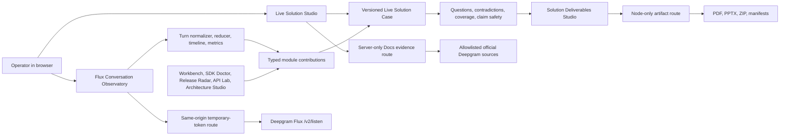
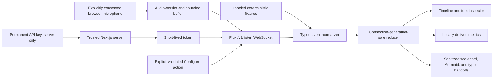

# Application Architecture

The Deepgram Applied Voice Lab is a Next.js 16, React 19, and TypeScript
browser/PWA application. Most learning, case-management, and decision logic is
deterministic and local-first. Narrow server routes own permanent credentials,
external documentation retrieval, guarded provider calls, and binary artifact
generation.

## System shape



No module writes to a separate customer-data database solely for this workflow.
The browser remains the authority for a local case unless an existing,
explicitly configured Architecture Studio provider is selected.

## Case and evidence flow

Live Solution Studio owns the `live-solution-case-v1` bundle: case metadata,
typed items, relationships, ledger events, question candidates, conflicts, and
source references. Case items keep provenance, verification state, confidence,
claim-safety state, visibility, and export policy separate.

Payload & Code Workbench, SDK Doctor, Release Radar, API Lab, Architecture
Studio, and pre-sales workflows contribute through the shared
`CaseModuleContribution` contract. A contribution proposes typed items,
relations, questions, warnings, validation results, sources, and actions; it
does not silently rewrite unrelated case state. API Lab contributes test
evidence only after an explicit execution and keeps that result scoped to the
tested request and environment.

Deterministic engines derive:

- the best next decision-critical question and secondary candidates;
- discovery coverage without a fabricated percentage;
- structured contradictions without silently choosing a winner;
- claim-safety wording and export preflight; and
- decision, risk, action, validation, and relationship views.

Corrections supersede prior items instead of deleting history. A full local
purge removes the case and its ledger together.

## Client and server boundaries

Browser responsibilities:

- problem intake, explicit paste/microphone actions, and case editing;
- local-first case persistence and revision checks;
- deterministic questions, contradictions, readiness, and previews;
- safe semantic navigation and explicit download initiation; and
- short-lived browser credentials for supported realtime flows.

Server responsibilities:

- keep `DEEPGRAM_API_KEY` and Docs MCP authorization out of browser code;
- enforce method, input-size, timeout, host, and operation allowlists;
- retrieve and normalize official documentation evidence;
- execute explicitly requested Deepgram operations through narrow routes; and
- generate and validate PDF, PPTX, ZIP, and provenance artifacts in the Node
  runtime.

The Docs evidence route receives a redacted technical query, never the raw
transcript. It validates official documentation hosts and falls back to the
curated registry with an explicit fallback label.

## Flux Conversation Observatory data flow

`/flux-observatory` is a dedicated conversational-turn workspace, distinct
from both the Nova `/v1/listen` Live Mic and the general-purpose Live
Observatory Lab.



Synthetic Replay and Live Provider Mode use the same typed event schema,
normalizer, reducer, timeline renderer, metric calculator, scorecard builder,
and export sanitizer. The reducer tolerates partial, malformed, duplicate,
out-of-order, unknown, and obsolete-generation messages without silently
turning them into valid turn evidence.

The permanent `DEEPGRAM_API_KEY` is read only by the server-side token grant.
The token route is same-origin, rate-limited, bounded, and disabled in hosted
review mode unless live browser realtime is explicitly enabled. The temporary
credential exists only in browser memory and is cleared on stop, error, expiry,
reconnect, and unmount. The socket authenticates with the Bearer WebSocket
subprotocol; credentials are not URL parameters.

Live capture currently uses mono linear16 PCM, an AudioWorklet, resampling to a
supported target rate, and bounded `bufferedAmount` backpressure. The configured
chunk target is measured separately from actual local cadence. Provider
messages do not share the audio-critical rendering path.

`Connected`, `ConfigureSuccess`, `ConfigureFailure`, provider error/warning,
and `TurnInfo` (`Update`, `StartOfTurn`, `EagerEndOfTurn`, `TurnResumed`, and
`EndOfTurn`) are normalized. Unknown future events remain sanitized and
inspectable. Configure requests preserve previous, requested, and acknowledged
values; failure retains the last acknowledged configuration.

The Observatory keeps bounded session evidence in memory. Its explicit
scorecard exports omit transcripts, audio, credentials, provider URLs, and
internal stacks. Typed handoffs contribute configuration, evidence status,
risks, questions, and architecture boundaries to the existing case and
Architecture Studio contracts without creating another persistence layer.

This architecture is **Implemented with deterministic fixtures**. The live
provider path is repository verified, but a real microphone/provider run has
not been retained as evidence; **Manual validation required** and **Production
readiness not established**. See
[Flux Conversation Observatory](FLUX_CONVERSATION_OBSERVATORY.md).

## Deliverable compilation

Solution Deliverables Studio consumes the current case revision. It does not
create a competing case store.

1. Active, non-superseded, profile-approved items become a sourced narrative.
2. Readiness and claim safety run independently of generation success.
3. Case components and relationships become strict Mermaid plus a text
   alternative and sanitized SVG.
4. Bounded manual edits are marked user-edited and audited; they never acquire
   evidence merely by being typed.
5. The Node-only `/api/deliverables/generate` route produces and validates a
   one-page PDF, editable PPTX, source manifest, internal reviewer brief, and
   customer ZIP.
6. The browser enables a download only when the returned artifact is current
   for the active input fingerprint and has passed its validation.

The optional redacted case file is disabled by default. When selected, it is an
allowlisted projection; it is not a raw serialization of browser state.

## Persistence and offline behavior

Case editing, deterministic reasoning, curated registries, and most previews are
local-first. Solution Deliverables generation does not need an AI provider or
external network, but binary output requires the local or hosted Next.js server
route. Export history stores metadata only: time, profile, readiness, revision,
and artifact count.

Flux Synthetic Replay works without a provider, credential, microphone, or
network after the application assets are available. Live Provider Mode requires
the local/hosted Next.js token route, an authorized server credential, network,
browser microphone permission, and a supported browser audio stack. Observatory
sessions are not automatically persisted.

Pocket Deepgram uses the same application shell and guarded module routes. The
PWA cache excludes API responses, authenticated or range requests, audio, and
video. Offline availability in the capability matrix means usable without an
external provider; “Limited” may still require the local application server.

## Safety boundaries

- Pasted code and imported Markdown are data, never executable input.
- Mermaid uses a bounded grammar; initialization, click, HTML, callbacks,
  external media, and unsafe protocols are rejected.
- Customer exports exclude private-only, do-not-claim, superseded, rejected,
  secret-bearing, and unapproved technical content.
- Proposed decisions and possible release findings retain qualification.
- Provider calls, microphone use, case purge, and downloads require explicit
  actions.
- keyboard companion commands open safe semantic surfaces; default profiles do not
  execute APIs, download packs, purge cases, publish, commit, or share.

See [Security and Privacy](SECURITY_AND_PRIVACY.md) and
[Solution Deliverables Studio](SOLUTION_DELIVERABLES_STUDIO.md).

## Testing strategy

Zod/domain tests cover schemas and deterministic engines. Artifact tests inspect
PDF page count, PPTX Open XML structure, safe Mermaid/SVG, ZIP paths,
checksums, and source manifests. Playwright covers user workflows with mocked or
synthetic provider boundaries. Release gates also include lint, TypeScript,
secret audit, `git diff --check`, and a production build.

Synthetic checks establish deterministic behavior only. Live Deepgram account
entitlements, real-network behavior, audio quality, and customer acceptance
remain bounded manual verification.

## Canonical benchmark architecture

Stage 3 adds a provider-neutral evidence layer above the existing Evaluate
execution boundary. `EvaluationEvidenceBundle` remains the atomic TTS
observation; benchmark services validate, segment, aggregate, compare, hash,
and rank those observations without creating a second provider executor.

```text
Evaluate action / future modality action
  -> Stage 2 identity, trust, quota, budget, and concurrency admission
  -> canonical provider adapter
  -> versioned atomic evidence
  -> benchmark methodology + suite + case + run
  -> separated measurements / human judgments / automated judgments
  -> comparability and eligibility decision
  -> metric-specific leaderboard snapshot
  -> canonical SHA-256 + optional server-only signature
```

Authoritative benchmark persistence is normalized under the private Supabase
schema. Browser roles have no direct table writes; server-only read services
validate the exact owner-authorized and bounded public-list projections.
Retention extends the existing bounded maintenance entry point, and
publication/rating/snapshot races are protected by database constraints and
locks. The initial UI is an additive, nonbillable, non-public synthetic setup,
canonical result detail, and leaderboard preview beneath `/evaluate`; it
exercises shared planning/materialization, generic ranking, and explanation
without making a provider-performance claim.

STT and realtime categories are represented by modality-neutral contracts but
their execution paths remain deferred. Live TTS continues to use the existing
Evaluate handler and Stage 2 cost boundary, disabled by default. See
[Benchmark Engine and Leaderboards](BENCHMARK_ENGINE_AND_LEADERBOARDS.md).

## Open Lab, Flux TTS, and ONE additions

Verification date: **2026-08-14**

The community-built Lab is a Next.js 16.2.11 and React 19.2.4 App Router application with TypeScript, Zod boundary validation, local-first browser state, and narrow Node route handlers for credentialed or binary work. It is not an official Deepgram product, production certification, or roadmap statement.

## Public Open Lab

`OPEN_LAB_MODE` controls the public UX. `OPEN_LAB_DEEPGRAM_ENABLED` is the private server-side provider switch and must be explicitly true for Open Lab live calls. The status strip exposes only those safe booleans: it never serializes `DEEPGRAM_API_KEY` or account metadata. Provider-disabled mode keeps synthetic/local learning tools usable.

When Open Lab is explicitly enabled, it takes precedence over the legacy Vercel/hosted-review presentation gate so a hosted visitor receives the public lab rather than account or showroom restrictions. Consent, microphone disclosure, route validation, and the provider kill switch still apply.

Browser REST action -> narrow `/api/deepgram/*` route -> schema/registry/kill-switch policy -> server-only `DEEPGRAM_API_KEY` -> documented Deepgram endpoint. `/api/deepgram/execute` rejects arbitrary host/path override and public account-data families; Open Lab has no Management write plane.

Browser realtime connect -> `/api/deepgram/token` -> server `POST /v1/auth/grant` -> short-lived JWT with `Cache-Control: no-store` -> in-memory bearer-subprotocol connection -> token-reference cleanup. Permanent credentials never enter browser state.

## Flux TTS

Flux TTS Studio is a sibling of the existing Aura TTS module. An explicit batch action posts validated JSON to `/api/deepgram/flux-tts`. The route checks the provider switch, a dated voice registry, non-empty bounded text, and documented encoding/container/sample-rate combinations before making server-side `POST https://api.deepgram.com/v2/speak`. It returns binary audio with the provider content type, safe request identifier, and `no-store`. It has timeout/abort cleanup and no automatic retry.

Current official docs checked on 2026-08-14 list 36 English voices. The Lab's explicit execution policy registers 35, excluding documented `flux-conor-en`; stale `flux-renee-en` is absent. The visible Early Access badge is Lab maturity, not a provider lifecycle claim.

Flux WebSocket streaming remains disabled. Official docs describe the endpoint, bearer JWT pattern, raw audio, and message lifecycle, but this deployment has not proven the complete browser auth/audio path. The Lab does not emulate streaming with delayed batch audio and does not introduce a long-lived serverless relay.

## Inspection and provenance

The shared flight recorder records local run ID, module, transport, model, event type, timestamp, optional duration/request ID, source, provenance, redaction state, and sanitized payload. It distinguishes measured, provider event, inferred, simulated, and human-rated evidence. Keys, JWTs, Authorization, cookies, environment values, unapproved raw microphone audio, and Flux input text are excluded from traces.

## Local-first solution architecture

Live Solution Studio owns the versioned case bundle. Modules contribute redacted evidence through typed handoffs. Deterministic engines derive questions, coverage, contradictions, claim safety, and export preflight. Official documentation retrieval is server-only and allowlisted.

Solution Deliverables Studio reads the approved case, builds a sourced narrative, validates readiness/claims, generates strict Mermaid and safe SVG locally, then calls a Node-only binary route for PDF, PPTX, manifests, checksums, and ZIP. Download is explicit.

Architecture Studio optionally uses its existing provider boundary for cross-device sessions; absent configuration retains one-browser demo behavior. Pocket persists only bounded UI state. Provider execution remains registry-allowlisted and capability-specific.

## ONE design architecture

Global semantic seeds are `#9966cc` (ONE selection/navigation) and `#009966` (live/connected/verified/success), with accessible derived text variants and dark neutral surfaces. Reusable primitives cover page shells, heroes, status strips, workspaces, panels, live badges, inspector docks, empty states, and the Omni watermark integration. Central CSS provides focus-visible, reduced-motion, mobile, tablet, and desktop behavior while domain-specific workspaces retain their useful character.

No approved logo asset exists in the repository. The watermark is disabled by default until `/public/brand/omni-neural-engine-mark.svg` is supplied.

## Lab Evolution architecture

`src/lib/lab-evolution.ts` is a client-safe typed registry. It contains the recursive learning loop, delivery graph, evidence definitions, Git-backed timeline, current experiments and hypotheses, and per-module evolution profiles. It reuses `src/lib/capabilities/registry.ts` for shared capability truth and uses an explicit surface registry when control-room and standalone route IDs differ.

```text
Human intent -> Codex -> working tree -> Git commit -> GitHub
  -> Vercel -> live Learning Lab -> evidence / feedback -> next iteration

Codex -> Entire development-context capture  [Experimental idea]
```

GitHub is canonical source control. Vercel is deployment infrastructure. Entire is a parallel observational context layer only: it does not modify commits, branches, pull requests, builds, previews, production promotion, or the existing GitHub-to-Vercel path. No Entire checkpoint identifier is recorded when none is evidenced.

The `LabEvolution` client component renders this data in the shared ONE shell. `ModuleEvolutionAffordance` reads the same profiles for each supported module and does not create a separate history. Mobile layouts present the loop and development graph as vertical flows; desktop can preserve connected nodes and wider spacing.

**Repository verified (2026-08-14):** the local post-feature gates passed lint/typecheck, 440/440 combined tests, default Playwright with 76 passes and 6 intentional project-guard skips, 30/30 Open Lab tests, the Next.js 16.2.11 production build, a 379-file secret audit, and diff check. `PayloadInspector` keeps server and first-client output deterministic with ISO timestamps, then shows browser-local time after hydration; the cross-timezone regression passed. Exact configured key-value occurrences were 0 in `.next/static` and scanned `.next` text. The bounded Flux live attempt made one Cole and one Jack request; both returned sanitized authorization failures and no audio. Hydration-fix commit `24f1340` was pushed, draft PR #4 exists, and the matching Vercel preview reached Ready. Clean-session Overview desktop plus Lab Evolution/Flux 390px checks passed with no captured errors. This remains preview evidence, not production deployment or live-provider proof. **Experimental idea:** Entire remains observational; no checkpoint was created because the Entire CLI was unavailable. See [Lab Evolution](LAB_EVOLUTION.md).
